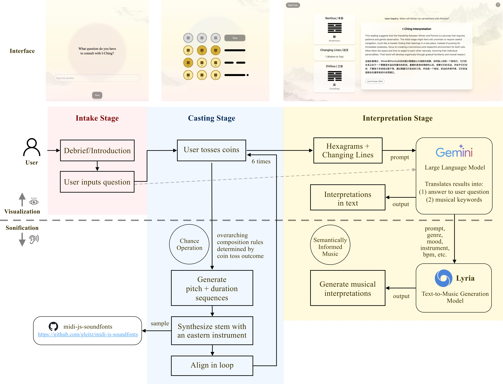

# Music of Changing Lines
 
**Music of Changing Lines** is an interactive web application that reimagines the I-Ching (*Book of Changes*) as a participatory sonic ritual. Rather than treating the I-Ching as a neutral randomizer in the tradition of John Cage's *Music of Changes*, this system re-centers it as a culturally situated, meaning-bearing framework, integrating divination, AI-driven interpretation, and generative music.
 
Users perform the Wen Wang Fa coin-casting method to generate hexagrams and changing lines, which are then interpreted by a large language model (Gemini) in relation to their personal inquiry. That interpretation conditions a real-time generative music model (Lyria) to produce a responsive sonic realization of the divination outcome.
 
**Authors:** Ling Qi · Aleksandra Teng Ma · Alexandria Smith — Georgia Institute of Technology, School of Music

## Resources
 
- 📄 Paper: [arxiv](https://arxiv.org/abs/2605.20386)
- 🎞️ [Walkthrough Video](https://vimeo.com/1150693113?share=copy&fl=sv&fe=ci)
- 🖼️ [Slides](https://prezi.com/view/FORFhQIicL4tST9hzqCV/?referral_token=fL7ti1lnB3FN); presented at International Computer Music Conference (ICMC) 2026, Hamburg




---
 
## Running Locally
 
Due to API quota pricing and throttling constraints, we don't currently have a public live deployment. You can run the app locally by registering for a free API key from Google AI Studio.

### Prerequisites
 
- [Node.js](https://nodejs.org/zh-cn/download) — install via the link or using `nvm`:
```bash
nvm install 20
nvm use 20
```

> Node 20 is required for compatibility with Tailwind CSS.
 
### Install Dependencies
 
```bash
npm install
```
 
### API Key Setup
 
The interpretation stage calls Google's Gemini (LLM) and Lyria (text-to-music) APIs. You'll need to generate your own API key:
 
1. Go to [https://aistudio.google.com/api-keys](https://aistudio.google.com/api-keys)
2. Click **Create API Key**, enter a name and project
3. Copy the key and add it to the `.env` file in the project root:
```
VITE_GEMINI_API_KEY=<Your API Key>
```
 
> **Note:** Do not commit your `.env` file. Add it to `.gitignore` to prevent key leakage.
 
### Run the Dev Server
 
```bash
npm run dev
```
